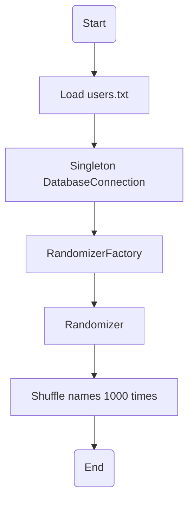

## Over-Engineered Name Randomizer 🤓

Welcome to the world's most unnecessarily complex solution for a straightforward task: randomizing names from a `users.txt` file!

### Features:

- Uses **Singleton Pattern** because we believe there should be only one way to fetch names.
- Implements the **Factory Pattern** because why create an instance of a class the straightforward way when you can complicate it?
- Shuffles the names not once, but **1000 times** because... security? We believe in going above and beyond for no apparent reason!

### Quickstart:

1. Make sure you have Python installed.
2. Clone this repository.
3. Ensure you have a `users.txt` file in the same directory as the script. Each name should be on a new line.
4. Run the main script using the command: `python randomizer.py`

### Code Overview:

- **Singleton Pattern**: We've ensured that only one instance of `DatabaseConnection` can ever exist because who needs more than one connection to read a text file?
- **Factory Pattern**: An over-the-top approach to simply read and shuffle names.
- **Decorator**: For those who believe that shuffling once is too mainstream, we shuffle the names a whopping 1000 times!

### Warning:

Please don't take this README (or the code) too seriously. This project is intended for humorous purposes only.

### Diagram

### Contribution:

Feel free to make this solution even more complicated or add other funny features. Remember, the sky is the limit when over-engineering is concerned!
